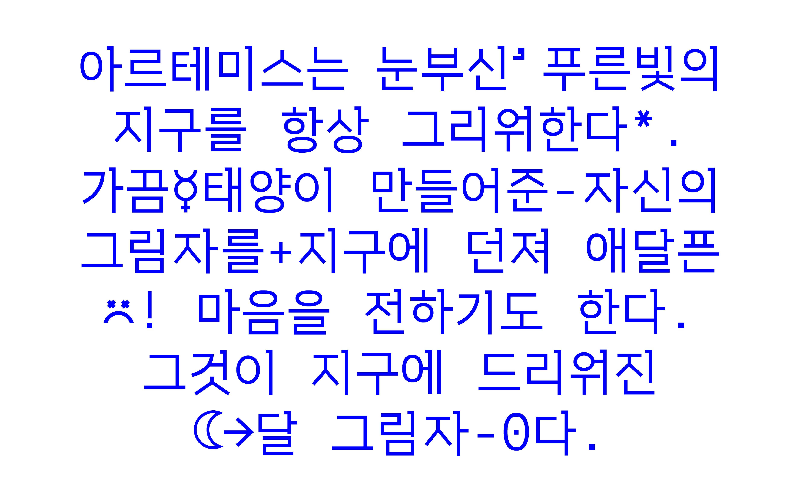

# Orbit Project

Font inspired by monospaced Latin coding font. Korean fonts are usually already monospaced, but brought the impression of the Latin coding font in the Hangeul and punctuation designs. This font gives a mathematical and geometric impression through a serif with right angle and orbicular circle. Attempts to express orbitals with typeface using symmetry and connectivity create a somewhat cosmic and futuristic atmosphere. As it is reminiscent of coding interface screens, it is recommended to use bright writing on a dark background, below 10pt.

It is designed especially for Hangeul typography, but it also includes Latin alphabet as a part of KS X 1001. This typeface has a regular weight.

## Basic Information
orbit was released in 2022. 
It consists of a full set of modern Hangeul syllables(11,172 characters), Google Latin plus set, and punctuations and symbols in KS X 1001.
This typeface has a regular weight. 

- Orbit was released in 2022.
- The full set of modern Hangeul syllables(11,172 characters) is completed in 2022.

## Designer
Sooun Cho

## License
SIL Open Font License ([OFL.txt](OFL.txt))
